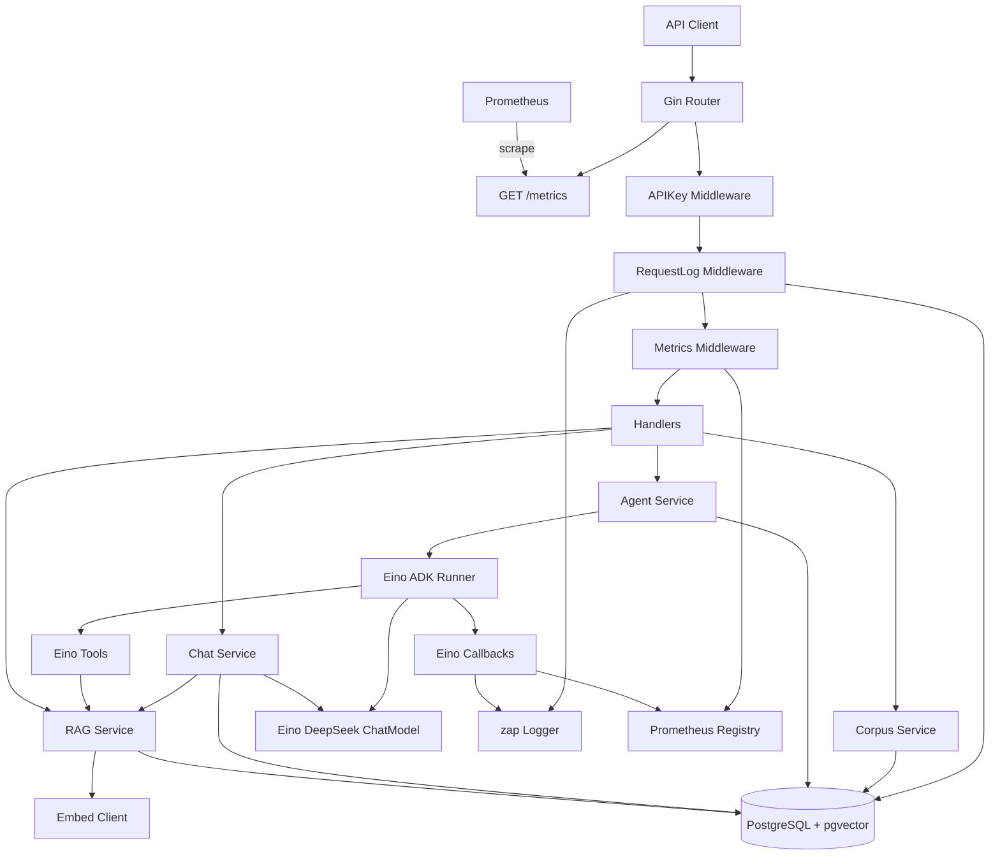

# AI Agent 项目规划书

> 模块：`github.com/webapp/go-app/ai-agent`  
> 关联文档：[API.md](./API.md)、[AGENT_TOOLS.md](./AGENT_TOOLS.md)、[DB_SCHEMA.md](./DB_SCHEMA.md)、[README.md](../README.md)

---

## 1. 项目定位

基于 Go 的独立 AI Agent 后端服务，对接 DeepSeek 大模型，提供：

- 流式多轮对话（会话持久化 + SSE）
- Tool Calling Agent（ReAct 风格，M4 起由 CloudWeGo Eino ADK 编排）
- RAG 知识库检索增强（PostgreSQL + pgvector）
- API Key 鉴权
- 完整请求日志（zap + PostgreSQL）
- Prometheus 监控（`/metrics`）

默认端口 `:18090`。

### 1.1 第一期范围

| 能力 | 说明 |
|------|------|
| A 流式对话 | 会话/消息落库；DeepSeek `stream`；SSE 输出 |
| B Tool Calling Agent | 函数调用循环；内置 `knowledge_search`、`current_time`、`calculator` |
| C RAG | 语料上传、分块、Embedding、pgvector TopK |
| 鉴权 | `X-API-Key` |
| 日志 | HTTP + LLM + Agent 步骤完整记录 |
| 监控 | Prometheus 指标，前缀 `ai_agent_` |

### 1.2 第一期不做

- 多租户隔离、JWT 用户体系、管理后台 UI
- 自建 Grafana / Alertmanager 部署（仅提供 scrape 示例与建议告警清单）
- Python/TS 侧 LangChain / LangGraph / CrewAI 等编排框架

---

## 2. 技术选型

| 层级 | 选型 | 说明 |
|------|------|------|
| 语言 | Go 1.25 | 与仓库现有模块一致 |
| HTTP | Gin | 路由 / 中间件 / SSE |
| 日志 | uber-go/zap | 结构化日志；HTTP 与 LLM 统一字段 |
| DB | PostgreSQL 16+ + GORM | 会话、消息、语料、请求日志；社区版免费 |
| 向量 | pgvector | `chunks.embedding vector(n)` + IVFFlat/HNSW |
| 配置 | YAML + 环境变量 | `DEEPSEEK_API_KEY`、`API_KEYS`、`DATABASE_URL` / `PG_DSN` |
| LLM（M1–M3） | 自研薄封装 OpenAI 兼容 HTTP | 打通 chat stream；接口抽象便于 M4 切换 |
| LLM（M4+） | Eino + `eino-ext/.../deepseek` | stream、tool calling、reasoning |
| Agent（M4+） | Eino ADK（ChatModelAgent / Runner） | ReAct/Tool 循环、流式事件 |
| Embedding | OpenAI 兼容端点（默认 Ollama） | DeepSeek 无 Embedding；维度与 pgvector 列一致 |
| 向量检索 | SQL `ORDER BY embedding <=> $1` | 自研 `RAGSvc`；不用独立向量库 |
| 鉴权 | `X-API-Key` 中间件 | 配置中维护 key 列表 |
| 流式 | SSE（`text/event-stream`） | Handler 将模型/Agent 流转为 SSE |
| 监控 | prometheus/client_golang | `/metrics`；Eino Callback 挂钩业务指标 |

**数据库**：整库使用 PostgreSQL Community + pgvector（均免费开源）。驱动 `gorm.io/driver/postgres`；启动时执行 `CREATE EXTENSION IF NOT EXISTS vector`。

### 2.1 Eino 边界

| 使用 Eino | 不使用 Eino 替换 |
|-----------|------------------|
| DeepSeek ChatModel | Gin 路由、API Key |
| Agent Runner、Tool 注册与执行循环 | zap、PostgreSQL 会话/语料/请求日志 |
| 流式输出迭代 | Prometheus Registry |
| | pgvector 检索 SQL |

工具 `knowledge_search`：以 Eino Tool 包装自研 `RAGSvc`。

### 2.2 DeepSeek 模型

| 模型 | 用途 |
|------|------|
| `deepseek-v4-flash` | 默认日常对话、高频请求 |
| `deepseek-v4-pro` | 复杂推理（可选） |

API：`POST {base_url}/chat/completions`，`Authorization: Bearer ${DEEPSEEK_API_KEY}`。  
默认 `base_url`：`https://api.deepseek.com/v1`。

---

## 3. 总体架构



### 3.1 分层

| 层级 | 职责 |
|------|------|
| `handler` | 参数校验、SSE 写出（适配 Eino 事件流） |
| `service` | 会话 / Agent 门面 / RAG / 语料 |
| `ai/eino` | Eino ChatModel、ADK Runner、Tool、Callback 装配（M4） |
| `embed` | Embedding 薄客户端 |
| `middleware` | API Key、请求日志、Prometheus、recover |
| `metrics` | 指标注册与命名约定 |
| `model` | GORM 持久化 |

原则：Handler 不直接调 DeepSeek；经 `llm` / Eino 封装，便于替换模型与记录用量。

---

## 4. 核心能力设计

### 4.1 流式多轮对话

- 表：`conversations`、`messages`
- M2：自研 `llm.Client` 打通 `POST /api/v1/chat/completions/stream`
- M4：Chat 模型调用切换到 **Eino DeepSeek ChatModel**
- 流程：组装历史 → 可选 RAG 注入 system → stream → SSE（`delta` / `done` / `error`）
- 流结束后落库 assistant 消息；写 `llm_call_logs` / token

### 4.2 Tool Calling Agent（M4：Eino ADK）

- `POST /api/v1/agent/runs/stream`
- Eino ADK `Runner` + `ChatModelAgent`（或等价 ReAct Agent）；`max_steps` 等走配置
- 内置工具：`knowledge_search`（RAG）、`current_time`、`calculator`（包路径 `internal/service/agent/tools`）
- SSE 事件：`tool_call`、`tool_result`、`delta`、`done`、`error`
- Callback：写 `agent_runs` / `agent_steps`、zap、Prometheus

### 4.3 RAG（PostgreSQL + pgvector）

- 语料上传 → 分块（`pkg/chunker`）→ Embedding → `chunks.embedding vector(dim)`
- 检索：`ORDER BY embedding <=> query_vec LIMIT k`（余弦距离）
- 索引：数据量增大后建 `ivfflat` 或 `hnsw`（见 [DB_SCHEMA.md](./DB_SCHEMA.md)）
- 接口：语料 CRUD、文档上传、重建索引、检索调试

**推荐索引策略**

| 数据规模 | 索引 |
|----------|------|
| &lt; 1 万 chunk | 可先无索引或 IVFFlat |
| 1 万～百万 | HNSW（`m=16, ef_construction=64` 起步） |
| 重建 | 文档变更后异步/接口触发 re-embed + 可选 `REINDEX` |

`dim` 必须与 Embedding 模型一致（如 Ollama `nomic-embed-text` 常为 768）。

### 4.4 完整请求日志

1. **zap**：request_id、method、path、status、latency、api_key_id、bytes
2. **PostgreSQL `request_logs`**：请求体/响应摘要、关联 `conversation_id` / `agent_run_id`、LLM 摘要、错误、token

流式：不整包缓存响应；记事件计数 + 最终文本长度 + 截断预览。

### 4.5 Prometheus 监控

- 暴露：`GET /metrics`（默认无需 API Key；可选 `metrics.protect: true`）
- HTTP labels：`method`、`path_template`、`status`（禁止高基数标签）
- 指标前缀 `ai_agent_`：

| 指标 | 类型 | 说明 |
|------|------|------|
| `ai_agent_http_requests_total` | Counter | HTTP 请求数 |
| `ai_agent_http_request_duration_seconds` | Histogram | HTTP 延迟 |
| `ai_agent_llm_requests_total` | Counter | LLM 调用（labels: model, stream, status） |
| `ai_agent_llm_request_duration_seconds` | Histogram | LLM 延迟 |
| `ai_agent_llm_tokens_total` | Counter | Token（labels: model, type=prompt\|completion） |
| `ai_agent_agent_runs_total` | Counter | Agent 运行次数 |
| `ai_agent_agent_steps_total` | Counter | Agent 步数 |
| `ai_agent_tool_calls_total` | Counter | 工具调用次数 |
| `ai_agent_rag_search_total` | Counter | RAG 检索次数 |
| `ai_agent_rag_search_duration_seconds` | Histogram | RAG 延迟 |

建议告警（第一期仅清单）：HTTP 5xx 比率、LLM P99、Agent 失败率、RAG 错误率。

抓取示例见 [`deploy/prometheus/scrape.example.yml`](../deploy/prometheus/scrape.example.yml)。

---

## 5. 目录结构（编码阶段脚手架）

```
ai-agent/
├── cmd/server/main.go
├── configs/config.yaml
├── configs/config.example.yaml
├── deploy/prometheus/scrape.example.yml
├── docs/{PROJECT_PLAN,API,DB_SCHEMA}.md
├── internal/
│   ├── app/
│   ├── config/
│   ├── database/
│   ├── model/
│   ├── metrics/
│   ├── middleware/
│   ├── handler/
│   ├── router/
│   ├── ai/eino/          # M4
│   ├── service/{chat,agent,rag,corpus,llm,embed}/
│   └── logger/
└── pkg/chunker/
```

---

## 6. 实施里程碑

| 里程碑 | 内容 |
|--------|------|
| **M0** | 规划文档落盘（本阶段） |
| **M1** | 脚手架 + Gin/zap/PostgreSQL/配置/API Key/请求日志 + `/metrics`；启用 `vector` 扩展 |
| **M2** | 自研 DeepSeek 薄客户端 + SSE 会话聊天 + LLM 指标（接口预留） |
| **M3** | 语料、分块、Embedding、pgvector 检索接入聊天 + RAG 指标 + 索引 |
| **M4** | 引入 Eino + DeepSeek 扩展；Chat 切 Eino；Agent 用 ADK + Tools + Callbacks + SSE |
| **M5** | 日志查询、用量统计、告警清单、测试与 README；清理 M2 遗留 LLM 路径 |

**编码顺序**：严格按 M1 → M5 推进；本仓库当前仅完成 M0。
